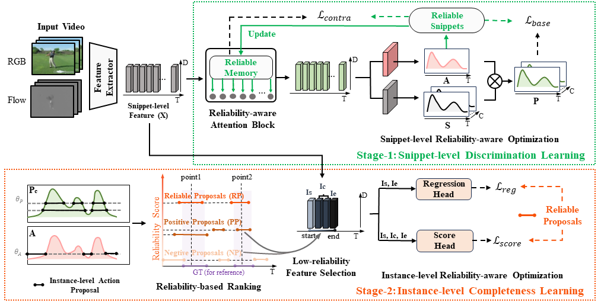

## HR-Pro: Point-supervised Temporal Action Localization via Hierarchical Reliability Propagation (AAAI24)

<p align="center">

  </p>

> **HR-Pro: Point-supervised Temporal Action Localization via Hierarchical Reliability Propagation**
>
> [Huaxin Zhang](https://scholar.google.com.hk/citations?user=oyfu0pgAAAAJ&hl=zh-CN), [Xiang Wang](https://scholar.google.com.hk/citations?user=cQbXvkcAAAAJ&hl=zh-CN), [Xiaohao Xu](https://scholar.google.com.hk/citations?user=3Ifn2DoAAAAJ&hl=zh-CN), [Zhiwu Qing](https://scholar.google.com.hk/citations?user=q9refl4AAAAJ&hl=zh-CN), [Changxin Gao](https://scholar.google.com.hk/citations?user=4tku-lwAAAAJ&hl=zh-CN), [Nong Sang](https://scholar.google.com.hk/citations?user=ky_ZowEAAAAJ&hl=zh-CN)
>
> **Abstract:**  *Point-supervised Temporal Action Localization (PSTAL) is an emerging research direction for label-efficient learning. However, current methods mainly focus on optimizing the network either at the snippet-level or the instance-level, neglecting the inherent reliability of point annotations at both levels. In this paper, we propose a Hierarchical Reliability Propagation (HR-Pro) framework, which consists of two reliability-aware stages: Snippet-level Discrimination Learning and Instance-level Completeness Learning, both stages explore the efficient propagation of high-confidence cues in point annotations. For snippet-level learning, we introduce an online-updated memory to store reliable snippet prototypes for each class. We then employ a Reliability-aware Attention Block to capture both intra-video and inter-video dependencies of snippets, resulting in more discriminative and robust snippet representation. For instance-level learning, we propose a point-based proposal generation approach as a means of connecting snippets and instances, which produces high-confidence proposals for further optimization at the instance level. Through multi-level reliability-aware learning, we obtain more reliable confidence scores and more accurate temporal boundaries of predicted proposals. Our HR-Pro achieves state-of-the-art performance on multiple challenging benchmarks, including an impressive average mAP of 60.3% on THUMOS14. Notably, our HR-Pro largely surpasses all previous point-supervised methods, and even outperforms several competitive fully supervised methods.*

## 🆕:Updates
- (2023-12-14) Code is available now.
- (2023-12-11) Code will be released soon.

## 📝:Results
The mean average precisions (mAPs) under the standard intersection over union (IoU) thresholds are reported.
Please note that the results reported here differ slightly from those in the paper due to the influence of the random seed.

| Dataset     |  @0.1 | @0.2 | @0.3 | @0.4 | @0.5 | @0.6 | @0.7 | AVG(0.1:0.5) | AVG(0.3:0.7) | AVG(0.1:0.7) |
| -----    | ----- | ----- | ----- | ----- | ----- | ----- | ----- | ----- | ----- | ----- |
|THUMOS14 | 85.1 | 81.1 | 73.9 | 64.0 | 53.1 | 40.5 | 25.3 | 71.4 | 51.4 | 60.4 |


## 📖:Installation
### Recommended Environment
* torch == 1.11.0+cu113
* torchvision == 0.12.0+cu113
* tensorboard == 2.8.0

You can install them by `pip install -r requirements.txt`


### Data Preparation
- We provide the features of THUMOS14 dataset we used [here](https://drive.google.com/file/d/1RkIk8KHxAacZBe4qjtbOTmxa5ulFeX2Z/view?usp=sharing), download and put them in `./dataset/THUMOS14`.
```bash
cd dataset/THUMOS14
tar -xzvf thumos_features.tar.gz
```
- You can also use the I3D model to extract features from [this repo](https://github.com/v-iashin/video_features)

Please ensure the data structure is as below.
~~~~
├── dataset
   └── THUMOS14
       ├── gt_full.json
       ├── split_train.txt
       ├── split_test.txt
       ├── point_labels
           └── point_gaussian.csv
       └── features
           ├── train
                ├── video_validation_0000051.npy
                ├── video_validation_0000052.npy
                └── ...
           └── test
                ├── video_test_0000004.npy
                ├── video_test_0000006.npy
                └── ...
~~~~

- We provide the I3D features of BEOID dataset [here](https://drive.google.com/file/d/1Xf7-Cg-7urpFVI9T4bqjZp3FdAiIaN4c/view?usp=sharing) and GTEA dataset [here](https://drive.google.com/file/d/1YUmmSK70ozLrSvvIpo64ruJb3ZFrvFzm/view?usp=sharing).


## 🚗:Training and Testing
- HR-Pro is a two-stage method, you can train it by running `bash run.sh`.

- You can also follow below steps to achieve snippet-level or instance-level optimization:
```bash
python main.py --cfg thumos --stage 1 --mode train
python main.py --cfg thumos --stage 1 --mode test
python main.py --cfg thumos --stage 2 --mode train
python main.py --cfg thumos --stage 2 --mode test
```
- Despite of viewing log files, you can also use TensorBoard to monitor the training process:
```bash
tensorboard --logdir=./ckpt
```

## 🛰️:References
We referenced the repos below for the code.
- [LACP](https://github.com/Pilhyeon/Learning-Action-Completeness-from-Points)
- [P-MIL](https://github.com/RenHuan1999/CVPR2023_P-MIL)

## 📑:Citation
If you find this repo useful for your research, please consider citing our paper:

```bibtex
@article{zhang2023hr,
  title={HR-Pro: Point-supervised Temporal Action Localization via Hierarchical Reliability Propagation},
  author={Zhang, Huaxin and Wang, Xiang and Xu, Xiaohao and Qing, Zhiwu and Gao, Changxin and Sang, Nong},
  journal={Proceedings of the AAAI Conference on Artificial Intelligence},
  year={2024}
}
```

